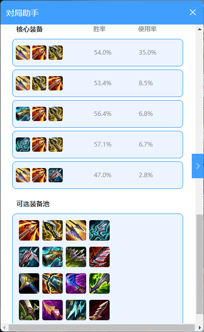

# Mousy

这是一个基于Vue 3和FastAPI开发的英雄联盟战斗工具应用，提供前后端分离的架构设计。

## 快速开始

### 下载安装包
1. 访问 [Releases](https://github.com/your-username/Mousy/releases) 页面
2. 下载最新版本的安装包
3. 双击安装即可使用

### 开发环境设置
如果您是开发者，需要设置开发环境，请参考以下说明。

## 开发环境配置
npm版本:23.3.0

### Python环境配置（使用Conda）
1. 安装Miniconda或Anaconda
2. 创建并激活虚拟环境：
```bash
conda create -n fastapi
conda activate fastapi
```
3. 安装依赖：
```bash
pip install -r server_app/requirements.txt
python build.py
```

4. 运行
```bash
npm run dev
```

## 技术栈

### 前端
- Vue 3
- TypeScript
- Element Plus
- Pinia (状态管理)
- Pinia (状态管理)
- Vue Router
- Axios

### 后端
- FastAPI
- Python 3.x
- Uvicorn
- Pydantic
- WebSocket

## 项目结构

```
LOL_fight_tools/
├── src/                    # 前端源代码
│   ├── assets/            # 静态资源
│   ├── components/        # Vue组件
│   ├── layouts/           # 布局组件
│   ├── router/            # 路由配置
│   ├── stores/            # Pinia状态管理
│   ├── types/             # TypeScript类型定义
│   ├── views/             # 页面视图
│   ├── App.vue            # 根组件
│   └── main.ts            # 入口文件
│
└── server_app/            # 后端源代码
    ├── api/               # API路由
    ├── models/            # 数据模型
    ├── services/          # 业务逻辑
    ├── utils/             # 工具函数
    ├── test/              # 测试文件
    └── main.py            # 服务器入口
```

## 功能一览（持续更新中）🥰

- **基础功能**
  - 自动接受对局 ✅
  - 战绩查询（支持队友与对手，支持隐藏战绩查询）✅
  - 推荐天赋、推荐出装 ✅

- **特色重磅功能**
  - **自动 B/P** 
    - 找到对局后自动接受对局 ✅
    - 进入英雄选择后自动选择英雄 ✅
    - 进入禁用环节时自动禁用英雄 ✅
  - **极地大乱斗专属优化**
    - 根据OPGG显示上方候选席英雄梯度，便于作出选英雄决策 ✅
    - 根据自定义英雄排名自动抢选心仪英雄 ✅
    - 候选席英雄冷却时也能优先抢到目标英雄 ✅
  - **开局查成分功能**
    - 进入 BP 后自动查队友战绩 ✅
    - 进入游戏后自动查对手战绩 ✅
  - **"小本本"功能（开发中）**
    - 对局结束后可一键拉黑不良队友或对手 ✅
    - 系统自动记录，方便日后管理和参考 ✅
    - 遇见小本本中记录的玩家自动提示 🚧
    - 云端同步 🚧

## 相关图片





## 许可证

[MIT License](LICENSE) 